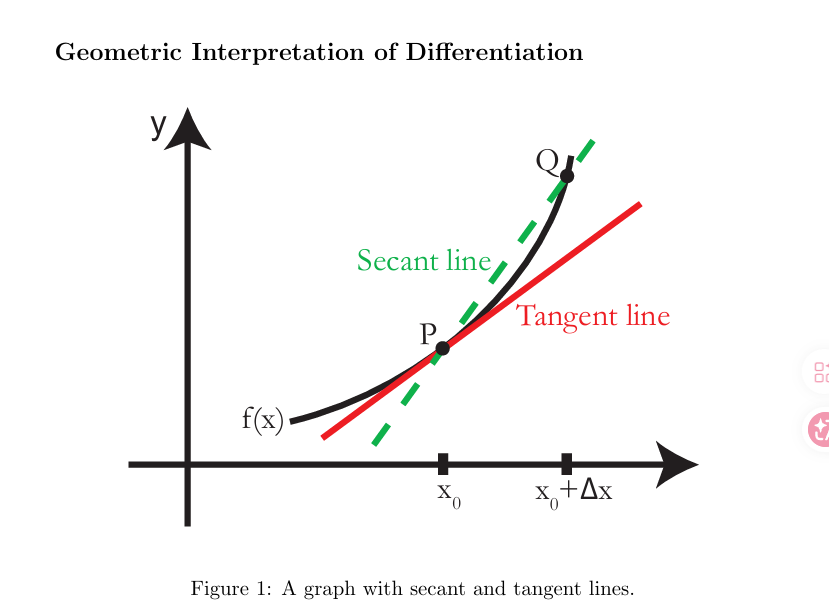
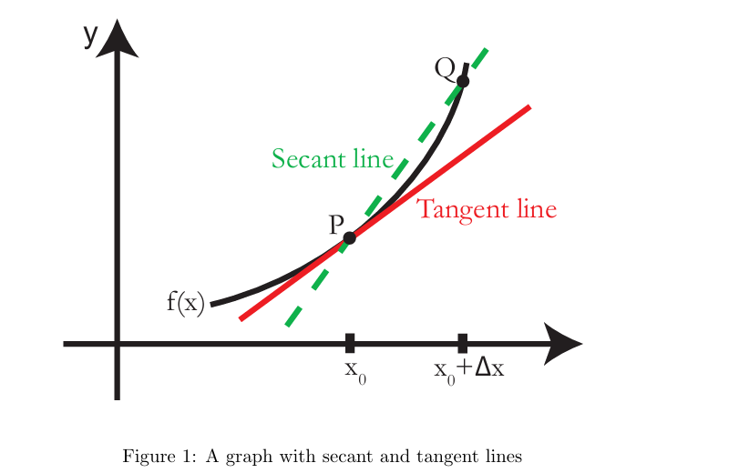
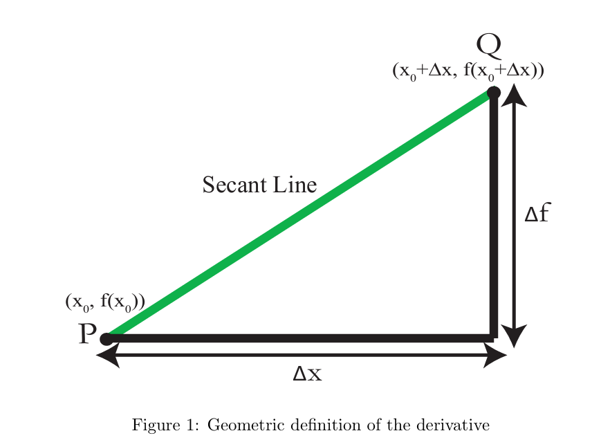

## 1.Introdution to Derivatives

### Clip 1: Introduction to 18.01

### Clip 2: Geometric Interpretation of Differentation

The derivative of $f(x)$ at $x = x_0$ is the slope of the tangent line to the graph of f(x) at the point $(x_0,  f(x))$.But what is a tangent line?

It is NOT just a line that meets the graph at one point. It is the limit of the secant lines joining points $P = (x_0, f(x))$ and $Q$ on the graph of $f(x)$ as $Q$ approaches $P$.

The tangent line touches the graph at $(x_0, f(x_0))$; the slope of the tangent line matches the direction of graph at that point. The tangent line is the straight line that best approximates the graph at that point.

Given a graph of our function, it is not hard for us to draw the tangent line to the graph. However, we will want to do computations involving the tangent line and so will need a computation method of finding the tangent line.

How do we compute the equation of the line tangent to the graph of the function $f(x)$ at a point $P = (x_0, y_0)$ ? We know that the equation of the straight line with slope $m$ through the point $(x_0, y_0)$ is $y - y_0 = m(x - x_0)$, so in the abstract we know the equation of the tangent line.

To get a specific equation for the line, we will know the coordinates $x_0$ and $y_0$ of the point $P$. If we know $x_0$ we can find $y_0 = f(x_0)$ by substituting the value $x_0$ in to the expression for $f(x)$. The second thing we need to know is the slope, $m = f'(x_0)$ , which we call the derivative of $f$.

**Definition :** The derivative $f'(x_0)$ of $f$ at $x_0$ is the slope of the tangent line to $y = f(x)$ at the point $P = (x_0, f(x_0))$.

### Clip 3: Limit of Secants

**Geometric definition of the derivative:**:

We are still trying to find a computational method of finding the equation of the tangent line - how do we compute the value of $m$ ?

In general, how do we know which lines are tangent lines and which lines are not ?

A secant line is a line that joins two points on a curve. If the two points are close enough together, the slope of the secant line is close to the slope of the curve. We want to find the slope of the tangent line $m$ - which equals the slope of the curve - and we use the slopes of secant lines to do this.

Suppose $PQ$ is a secant line of the graph of $f(x)$. We can find the slope of the graph at $P$ by calculating the slope of $PQ$ as $Q$ moves closer and closer to $P$ (and the slope of $PQ$ gets closer and closer to $m$).

The tangent line equals the limit of secant lines $PQ$ as $Q \to P$，here $P$ is fixed and $Q$ varies.

### Clip 4: Slope as Ratio

**Slope as Ratio**: While we are still thinking geometrically, we can now use symbols and formulas in our computation.

we start with a point $P =(x_0, f(x_0))$. We move over a tiny horizontal distance $\Delta x$

